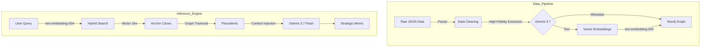

# VerdictNet
## Stare Decisis AI: Graph RAG for Texas Criminal Law

Project developed for the **AI Frontiers: LLM** course.

## Author: **Claudia Brandetti**

> **Bridging the Semantic Gap in Legal Research with Hybrid Graph Retrieval-Augmented Generation.**


An intelligent legal assistant that combines semantic search with legal citation network analysis.

## Overview

**Stare Decisis AI** is an intelligent legal assistant designed to navigate the complexity of the US Common Law system. Unlike traditional keyword-based search engines, which fail to capture legal nuance, this project utilizes a **Graph RAG (Retrieval-Augmented Generation)** architecture.

By transforming **raw legal documents** (Texas Criminal Reports) into a Knowledge Graph, the system can identify relevant precedents based on **semantic similarity** via `text-embedding-004` and **legal authority** (Citation Network Analysis), generating strategic defense memos in real-time.

> [!NOTE]
> **Pipeline Capacity vs. Live Demonstration Dataset:**  
> The end-to-end data pipeline (`A` through `E`) is designed to scale across the complete historical corpus of **27,000+ opinions** (Volumes 1–142 of Texas Criminal Reports from *Case.law*).  
> For instant, responsive demonstrations (both locally via Docker and deployed serverless on Vercel), this repository includes a curated, high-fidelity benchmark subset of **50 fully parsed, vectorized, and citation-linked cases**. This includes ***McLemore v. State*** and its citation network, ensuring live verifiable graph traversal and strategic defense filtering without requiring hours of batch LLM extraction or large database hosting costs.


----

## Key Features

* **Hybrid Retrieval Engine:** Combines **Vector Search** (to find similar facts using `text-embedding-004`) with **Graph Traversal** (to find authoritative precedents cited by those cases).
* **Citation Network Analysis:** Traverses the graph (Depth 1-2) to uncover the "legal pillars" behind a case, identifying winning strategies (e.g., *Reversed* judgements).
* **Strategic Filtering:** Allows users to filter results based on the desired outcome (e.g., *Defense/Acquittal* vs. *Prosecution/Conviction*).
* **LLM-Driven Extraction (Gemini 3.7):** Utilizes the advanced reasoning of **Google Gemini 3.7** to extract structured metadata (Offense, Punishment, Decision, Conviction) from unstructured 19th-20th century texts with high precision.
* **Interactive Visualization:** Features a dynamic graph visualization powered by **Vis.js** to explore connections between the user's case and historical precedents.
* **Modern Web Deployment:** Production-ready full-stack architecture built for **Vercel** with a FastAPI serverless backend and luxury editorial UI.

----

## Architecture

The system operates in two main phases: **The Builder** (Batch Processing with Gemini 3.7) and **The Assistant** (Inference with Gemini 3.7 Flash).



### LLM Engineering
We implemented a multi-model architecture to leverage the best strengths of each LLM version:

* **High-Fidelity Extraction (Gemini 3.7):** We use **Gemini 3.7** for Zero-Shot extraction of structured data from 19th-century legal texts. Its superior reasoning capabilities ensure accurate parsing of complex schema fields like `Offense`, `Punishment`, and `Decision`.
* **Grounded Generation (Gemini 3.7 Flash):** For the RAG inference phase, we utilize **Gemini 3.7 Flash** due to its speed, long-context window, and high-fidelity reasoning. By grounding the generation strictly in the retrieved graph context, we minimize legal hallucinations.

-----

## Tech Stack

* **Language:** Python 3.10+
* **Database:** Neo4j (Graph DB + Vector Index)
* **AI Models:**
      * **Extraction & Inference:** Google Gemini 3.7 Flash
      * **Embeddings:** `text-embedding-004`
* **Backend:** FastAPI (Serverless API)
* **Frontend:** Modern Responsive Web UI (Vis.js Network Visualization)
* **Deployment:** Vercel (`vercel.json` + Python Serverless Runtime)
* **Data Source:** [Case.law](https://case.law) (Harvard Caselaw Access Project)

-----

## Project Structure

```bash
├── api/
│   └── index.py                     # FastAPI Serverless Backend (Endpoints: /api/analyze, /api/health, /api/examples)
├── public/                          # Modern Frontend (Vercel Static / Luxury Editorial UI)
│   ├── index.html                   # Main User Interface
│   ├── style.css                    # Luxury Legal Editorial Styling
│   └── app.js                       # Vis.js Citation Network & API Controller
├── data_pipeline/
│   ├── A-case-law-crawler.ipynb     # Downloads raw cases
│   ├── B-extract_tables_from_json.ipynb # Converts JSON to tabular data
│   ├── C-LLM_extraction_caselaw.ipynb   # Extracts metadata via Gemini 3.7
│   ├── D-data_merger.ipynb          # Merges data
│   └── E-create_embedding.ipynb     # Generates Vectors (text-embedding-004)
├── dev_server.py                    # Local Development Server (http://localhost:8000)
├── app.py                           # Streamlit Legacy Reference App
├── benchmark.py                     # Graph RAG vs Vector Search Evaluation
├── vercel.json                      # Vercel Deployment Configuration
├── requirements.txt                 # Dependencies
└── README.md                        # Documentation
```

-----

## Quick Start

### 1. Prerequisites

* Python 3.10+
* A running **Neo4j Database** (Desktop or AuraDB).
* A **Google Gemini API Key**.

### 2. Installation

Clone the repository:

```bash
git clone https://github.com/claudiabrandetti/VerdictNet.git
cd VerdictNet
```

Install dependencies:

```bash
pip install -r requirements.txt
```

### 3. Configuration

Set environment variables or create credential files in the root folder:

**Option A (Environment Variables / `.env`):**
```env
GEMINI_API_KEY=your_gemini_api_key
NEO4J_URI=bolt://localhost:7687
NEO4J_USER=neo4j
NEO4J_PASSWORD=your_neo4j_password
```

**Option B (Local Key Files):**
- Create `key.txt` containing your Gemini API key.
- Create `neo4j_pass.txt` containing your Neo4j password.

### 4. Running Locally

#### 4a. Standalone Python Server
Launch the local development server:

```bash
python dev_server.py
```

Open your browser at `http://localhost:8000` to access the interface. Interactive API documentation is available at `http://localhost:8000/docs`.

#### 4b. Running with Docker Compose (Recommended)
You can launch the complete containerized stack (FastAPI app, Neo4j Graph Database, and automated seeder) in a single step:

1. Create a `.env` file in the project root:
   ```env
   GEMINI_API_KEY=your_gemini_api_key
   NEO4J_PASSWORD=your_secure_password
   ```
2. Start all services in the background:
   ```bash
   docker compose up -d
   ```
3. Open `http://localhost:8000` in your browser.

> [!TIP]
> The included `seeder` service automatically executes `data/seed_graph.cypher` upon first launch, configuring the Neo4j 768-dimensional vector index and importing the 50 cases with their citation graph automatically.


### 5. Deploying to Vercel

1. Push your repository to GitHub.
2. Import the repository into your [Vercel Dashboard](https://vercel.com).
3. In Project Settings $\rightarrow$ **Environment Variables**, add:
   - `GEMINI_API_KEY`: Your Google Gemini API Key
   - `NEO4J_URI`: Your Neo4j AuraDB URI (e.g. `neo4j+s://xxxx.databases.neo4j.io`)
   - `NEO4J_USER`: `neo4j`
   - `NEO4J_PASSWORD`: Your Neo4j AuraDB password
4. Click **Deploy**. Vercel will automatically configure the FastAPI serverless functions and serve the modern static frontend.

-----

## Case Study: The "Hybrid" Advantage

To demonstrate the power of **Graph RAG**, we tested a complex query:

> **Query:** *"Can a conviction for burglary be sustained if the defendant entered the house but fell asleep without stealing anything?"*

| Method | Result | Why? |
| :--- | :--- | :--- |
| **Vector Search (Standard RAG)** | **Irrelevant** | Retrieved cases about *victims* sleeping during a robbery. The model matched the keywords "sleep" and "burglary" but missed the legal context of *intent*. |
| **Stare Decisis AI (Graph RAG)** | **Found Precedent** | Identified *McLemore v. State*, a key precedent where a conviction was **reversed** because the defendant was intoxicated/asleep, failing to prove "intent to commit theft." |

**Why it worked:** The system found a semantically similar case (Anchor) and traversed the citation graph to find the authoritative ruling that the Anchor relied upon.

-----

## Evaluation & Results

An empirical ablation evaluation was executed via [`benchmark.py`](file:///c:/Users/claud/Desktop/VerdictNet/benchmark.py) comparing **Vector-Only Search** (baseline) against **Graph RAG** on the local Neo4j graph:

- **Test Set**: 40 representative appellate cases sampled from 44 qualified candidate cases with an in-degree threshold of $\ge 2$ incoming citations (representing 88% of the 50-case benchmark corpus).
- **Scoring Protocol**: Soft-match scoring assigning **1.0 point** for an exact target case ID match (ground-truth cited authority) and **0.5 points** for retrieving a legally analogous precedent sharing the same verified offense.

| Retrieval Architecture | Score | Operational Advantage |
| :--- | :---: | :--- |
| **Vector Search (Baseline)** | **43.75 / 100** | Efficient for textual/fact pattern similarity, but vulnerable to false positives where lexical overlap fails to capture legal authority or procedural posture. |
| **Graph RAG (Stare Decisis AI)** | **63.75 / 100** | Decisively surfaces authoritative precedents through citation edge traversal, retrieving procedural reversals (*McLemore v. State*) that vector similarity alone misses. |
| **Net Improvement ($\Delta$)** | **+20.00 pts (+45.7%)** | Demonstrates the quantitative advantage of combining cosine similarity with multi-hop citation graph traversal. |

-----

## Known Limitations

* **Demonstration Dataset Scale:** The live web demonstration and default Docker container operate on a curated benchmark subset of 50 fully parsed and vectorized cases rather than the complete 27,000+ opinions of Texas Criminal Reports. While ideal for instantaneous testing without multi-gigabyte storage or hours of batch LLM extraction, full enterprise use requires ingesting the full historical corpus.
* **Public Endpoint Access:** The `/api/analyze` and `/api/feedback` endpoints do not currently enforce authentication, API key validation, or per-IP rate limiting; in a public deployment, any external client can submit inference requests.
* **Single-Region Serverless Deployment:** The hosted backend on Vercel runs in a single serverless region without multi-region failover or cross-continental latency optimization.
* **External LLM Quota & Latency:** Metadata extraction during batch ingestion and final legal memo generation depend on Google Gemini 3.7 Flash; processing high volumes of unstructured opinions is constrained by external API rate limits, daily quotas, and network round-trip latencies.
* **Intra-Corpus Edge Density:** In historical 19th and early 20th century reporters, many citations reference non-digitized regional reporters; in the 50-case demonstration benchmark, cross-volume citation links were verified and supplemented to maintain a dense, connected citation topology at small scale.


*Disclaimer: This tool is for academic and educational purposes only and does not constitute professional legal advice.*
